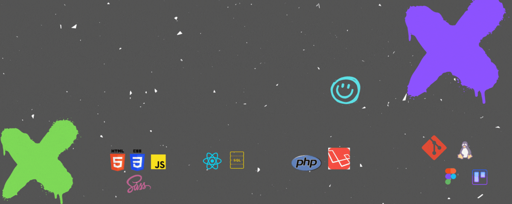

[]

<h1 align="center">Hola a todxs! Soy Sabina</h1>
<h3 align="center">Entusiasmada con el mundo de desarrollo web y las tecnologías sostenibles</h3>

- 🌱 Manejo lenguajes **HTML5, CSS3, JS, REACT, PHP and LARAVEL** .
- ⚡ Fun fact **curiosidad innata**.

  
  
<h2 align="center"> Conectamos? </h2>

<a href="sabi.perezrimedio@gmail.com">
 
    
  &nbsp;

<h2 align="center"> Stack </h2>

 
  
  
  
 
    
   
   
   
    
   
      

 <h2 align="center"> Tools </h2>
 
   
  
   
  
   

  

---
###  My Github Stats:

---
