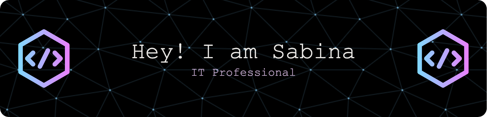
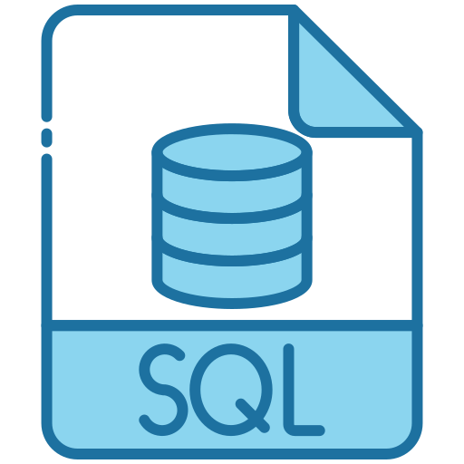

<h2 align="left">👋 ¡Hola!</h2>

  🎯 Soy una profesional técnica en transición al sector IT con formación en Desarrollo Full Stack PHP, Ciberseguridad Web y control de calidad de software. 
    
  🔍 Busco oportunidades como QA Tester, Desarrollador Full Stack PHP/Java o Soporte Técnico.

<h4>🧰 Stack Técnico</h4>

- **Lenguajes**: PHP · JavaScript · Java · SQL · Python (basic)
- **Testing / QA**: Postman · Git · Learning Cypress and Selenium
- **Ciberseguridad**: OWASP Top 10 · Burp Suite · Nmap · Wireshark · Splunk · tcpdump · Kali Linux
- **Control de versiones**: Git · GitHub
- **Entornos y herramientas**: Linux · macOS · Windows · Docker · Notion · Trello · Figma · Draw.io · Visual Studio Code · NetBeans

<h4>🚀 Actualmente </h4>

  
- 📚 Cursando FP Desarrollo de Aplicaciones Multiplataforma
- ✍️ Iniciandome en automatización de pruebas (Selenium, Cypress)  
- 🔧 Subiendo proyectos a GitHub

<h2>📫 Contacto</h2>

<a href="sabi.perezrimedio@gmail.com">
 
  &nbsp;

<h2 align="left">👋 Hello there!</h2>

  🎯 I’m a technical professional transitioning into the IT sector, with training in Full Stack PHP Development, Web Cybersecurity, and Software Quality Assurance.
    
  🔍 I'm open to roles such as QA Tester, Full Stack Developer (PHP/Java), or Technical Support.

  
<h4>🧰 Tech Stack</h4>
  
- **Languages**: PHP · JavaScript · Java · SQL · Python (basic)
- **Testing / QA**: Postman · Git · Learning Cypress and Selenium
- **Cybersecurity**: OWASP Top 10 · Burp Suite · Nmap · Wireshark · Splunk · tcpdump · Kali Linux
- **CVersion Control**: Git · GitHub
- **Systems & Tools**: Linux · macOS · Windows · Docker · Notion · Trello · Figma · Draw.io· Visual Studio Code · NetBeans

<h4>🚀 Currently</h4>

  
- 📚 Currently studying a Higher Vocational Education Program in Multiplatform Application Development  
- ✍️ Getting started with test automation (Selenium, Cypress)  
- 🔧 Uploading projects and scripts to GitHub
  

<h2>📫 Contact</h2>

<a href="sabi.perezrimedio@gmail.com">
 
    
  &nbsp;

  

<h2> Stack </h2>

 
  
  
  

    
     
   
   
   
  
   
   
   
     

 <h2> Tools </h2>
 

 
   
  
    
 

  

---
<h2> My Github Stats:</h2>

---

</a> Iconos de <a target="_blank" href="https://icons8.com">Icons8</a>

